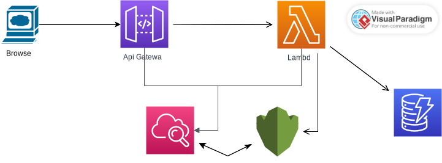
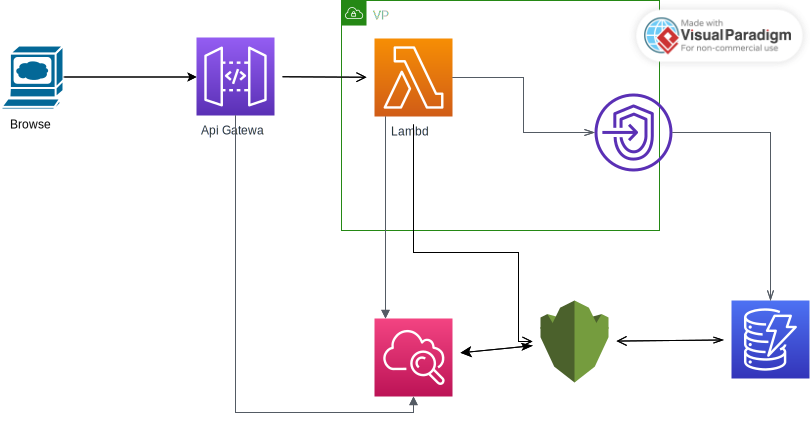

## The stack
This stack is a simple POC of how to read data from DynamoDB from a Golang Lambda and show results on the web page via ApiGW.

DynamoDB table is created by the Terraform and seeded with one record containing **id** and **text** of quote of the day.
Lambda function will fetch the first record from the dynamodb table and return the data under a form of json response.

**Note**: since this is a simple POC, certain shortcuts has been implemented such as:
* lack of testing in lambda
* terraform usage of local module (and not versioned artifact)
* most of the terraform resources have hardcoded attributes (compared to having them deployed through variables)

Depending on the setting in the `config.auto.tfvars` it can be deployed under two different designs:
* Standalone Lambda
* Lambda deployed via VPC

### Standalone lambda
In this (default) design, lambda is not deployed to any vpc, Api GW will call Lambda, which in turn will call DynamoDB table

Both Api GW and Lambda will send their logs to two different cloudwatch groups.

Encryption is done by KMS and covers:
* Cloudwatch Logs
* DynamoDB
* Lambda configuration Environment

### Vpc based deployment
The deployment design based on VPC includes all the components of the `Standalone design`, and in addition to that,
it incorporates following additional elements
* Vpc (for the purposes of the POC it's CIDR range is not configurable)
* **Private** subnets
* Lambda is deployed to the vpc
* Security groups are attached to the lambda and manages it's allowed networking scope
* Communication to the DynamoDB is done via VPC Endpoint

Advantages of this approach:
* Easily access resources in your VPC (if any) from a lambda function
* Being able to control and restrict lambda access via Nacl & SG
* Network Audit logs

Disadvantages:
* Since lambda creates an ENI in your vpc, it can prevent the destruction of related subnet/security groups because it will
wait for the detachment of those ENI. This process can take up to an hour under certain circumstances

## Deployment
### Configuration
You can configure the stack behaviour by editing variables in `config.auto.tfvars`. For further information about possible
configuration values see `variables.tf`

### Requirements
The successful operation of this stack depends on the presence of the following software elements:
* Golang 1.20
* Terraform ~> 1.2
* Configured credentials for AWS account
* Pre-commit (optional, used to check the code quality. For installations see the [related page](https://github.com/antonbabenko/pre-commit-terraform#1-install-dependencies))

### Automated deployment
You can deploy the whole stack with zero input via `deploy.sh`.

**Note** if you are using `deploy.sh` in your CICD / ephemeral environment, you will need to amend the build stage and reset
executable's metadata, otherwise it will force a new deployment on every single terraform run.

### Manual deployment
To manually deploy the stack, you need to follow the steps below:
* Build `main.go` file contained in `code` folder and place the resulting binary named `qtd` (linux/amd64 arch) in the `bin`
folder created in the root of this repository. This steps needs to be repeated on every change in your lambda code
* From `infra` folder initiate terraform stack (`terraform init`) and deploy it with `terraform apply`

### Accessing lambda function
To access lambda function look for the output called `api_gw_endpoint`
